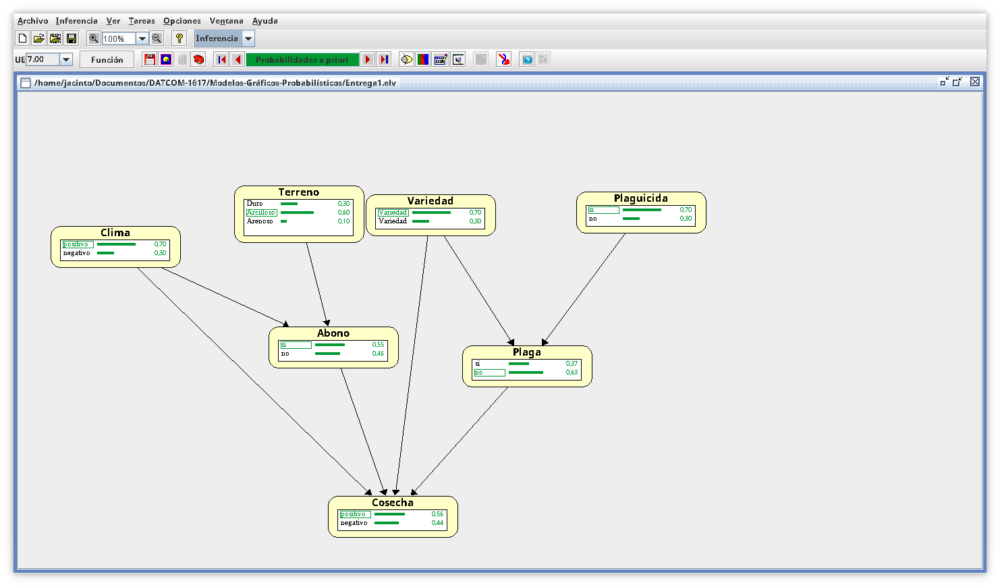
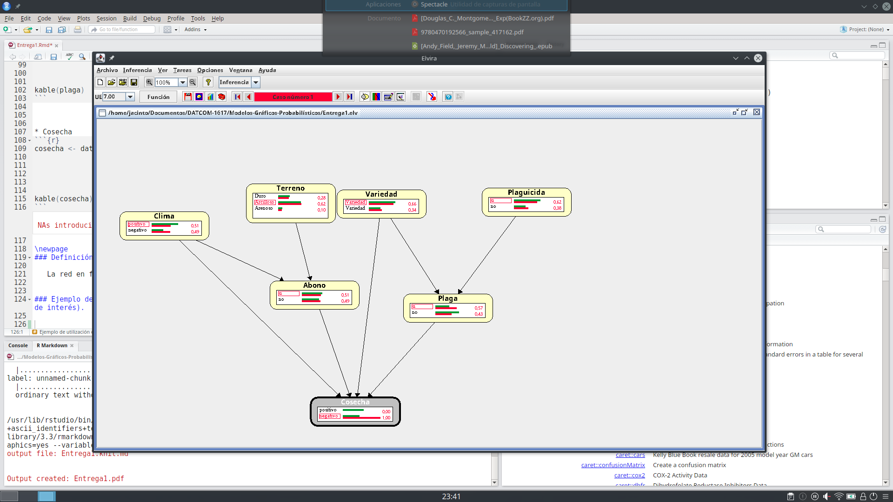
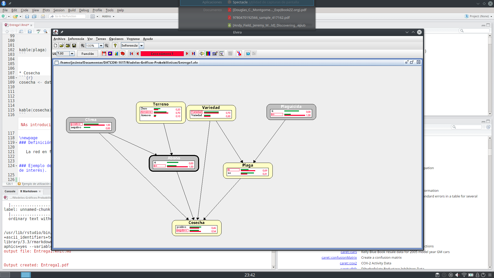

```{r setup, include=FALSE}
knitr::opts_chunk$set(echo = FALSE, fig.align = "center", fig.width = 3)
library(knitr)
```


### Descripción de un problema de tamaño pequeño (mínimo 7 nodos).

El problema consistirá en determinar si la cosecha de un año de un cultivo de trigo será superior o inferior a una cantidad preestablecida. Para ello usaremos la información correspondiente al clima durante ese año, el terreno en el que se ha plantado, la variedad del trigo, si la plantación ha sido afectada por la plaga y si se ha usado abono y/o plaguicida.

### Descripción de la red que represente el problema: Parte cualitativa y cuantitativa.

#### Parte cualitativa

   La red la mostramos en la Figura 1.
```{r}
system('echo \'
digraph DAG {

  # Intialization of graph attributes
  graph [overlap = false,
         layout = dot,
         rankdir = TD]

  # Initialization of node attributes
  node [shape = ellipse,
        fontname = Helvetica,
        fixedsize = false]

  # Initialization of edge attributes
  edge [color = black,
        rel = yields,
        fontname = Helvetica]

   Abono -> Cosecha
   Terreno -> Abono
   Clima -> Abono
   Clima -> Cosecha
   Variedad -> Plaga
   Plaga -> Cosecha
   Plaguicida -> Plaga
   Variedad -> Cosecha
}
\' > graph.dot')
system('dot -Tpdf graph.dot -o graph.pdf')
```


#### Parte cuantitativa 

* Clima
```{r}
clima <- data.frame(Positivo = 0.7, Negativo = 0.3)
kable(clima)
```


* Terreno
```{r}
terreno <- data.frame(Duro = 0.3, Arcilloso = 0.6, Arenoso = 0.1)
kable(terreno)
```


* Variedad
```{r}
variedad <- data.frame("Variedad A" = 0.6, "Variedad B"= 0.4)
kable(variedad)
```


* Plaguicida
```{r}
plaguicida <- data.frame("Sí" = 0.8, "No"= 0.2)
kable(plaguicida)
```


* Abono
```{r}
abono <- data.frame("Clima" = c("positivo","positivo","positivo","negativo", "negativo", "negativo"),
                    "Terreno" = c("Duro","Arcilloso","Arenoso","Duro","Arcilloso", "Arenoso"),
                    "Sí" = c(0.65,0.4,0.5,0.85,0.6,0.7),
                    "No"= c(0.35,0.6,0.5,0.15,0.4,0.3))
kable(abono)
```

* Plaga

```{r}
plaga <- data.frame("Plaguicida" = c("Sí","Sí","No","No"),
                    "Variedad" = c("Variedada A","Variedada B","Variedada A","Variedada B"),
                    "Sí" = c(0.2,0.3,0.6,0.9),
                    "No"= c(0.8,0.7,0.4,0.1))
kable(plaga)
```


* Cosecha
```{r}
cosecha <- data.frame("Abono" = rep(c("Sí","No"), each = 8),
                      "Clima" = rep(rep(c("Positivo","Negativo"),each=4),2),
                      "Plaga" = rep(rep(c("Sí","No"),each=2),4),
                      "Variedad" = rep(c("Variedad A","Variedad B"), 8),
                      "Sí" = c(0.4,0.5,0.95,0.9,0.2,0.25,0.35,0.4,0.35,0.25,0.8,0.7,0.05,0.07,0.3,0.2),
                      "No"= c(0.6,0.5,0.05,0.1,0.8,0.75,0.65,0.6,0.65,0.75,0.2,0.3,0.95,0.93,0.7,0.8))
kable(cosecha)
```

\newpage
### Definición de la red en el programa Elvira.

   La red en formato Elvira está en el fichero Entrega1.elv


### Ejemplo de utilización en Elvira (cálculo de alguna probabilidad condicionada o explicación más probable de interés).

   En la Figura 2 mostramos la red antes de realizar ninguna inferencia. Observamos que hay una mayor probabilidad de que la cosecha resulte positiva en términos de calidad o cantidad. 
   


   En la Figura 3 vemos cómo si fijamos que la cosecha ha resultado negativa, entonces aumenta la probabilidad de que el clima haya sido malo y de que haya habido plaga, disminuyendo por tanto la probabilidad de que se haya usado plaguicida y abono.



   En la Figura 4 vemos cómo si fijamos las variables de clima a Positivo, Abono a No y Plaguicida a No, entonces se obtiene una mayor probabilidad de que la cosecha resulte negativa.


